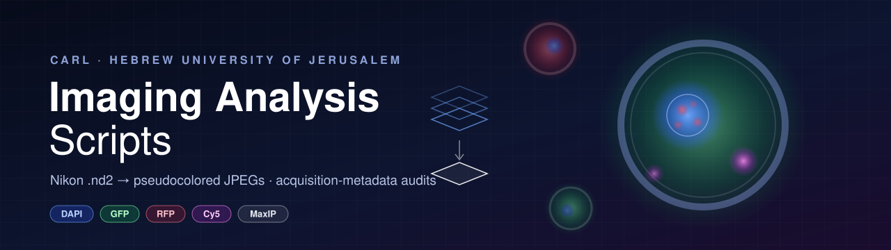
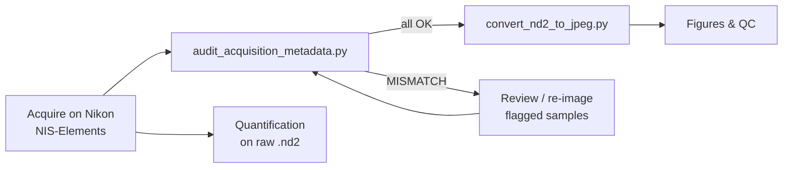

<p align="center">
  
</p>

<p align="center">
  
  
  
  
</p>

<p align="center">
  <b>Tools for turning Nikon <code>.nd2</code> microscopy data into figure-ready images and making sure every sample was imaged the same way.</b>
</p>

---

## Overview

This repository collects the image-processing utilities used by **CARL (Hebrew University of Jerusalem)** for fluorescence microscopy of mouse oocytes. They were written for the *Obese Mice: Comparative Assessment (Young, 8–16 weeks)* project, but nothing in them is specific to that dataset. They work on any folder tree of Nikon NIS-Elements `.nd2` files.

| Script | What it does | Output |
|---|---|---|
| [`convert_nd2_to_jpeg.py`](convert_nd2_to_jpeg.py) | Converts every `.nd2` in a folder tree into pseudocolored, auto-contrasted JPEGs, with one image per oocyte per channel plus a merged overlay. | `JPEG_export/` |
| [`audit_acquisition_metadata.py`](audit_acquisition_metadata.py) | Reads the acquisition settings stored in each raw `.nd2` and checks that all samples stained with the same antibody were imaged with the same settings. | `acquisition_audit.txt` |

Both scripts are **drop-in**: copy them into the top-level folder of your experiment and run them. They find every `.nd2` below that folder on their own.

---

## Quick start

```bash
# 1. Copy the script(s) into the root folder of your experiment
cp convert_nd2_to_jpeg.py audit_acquisition_metadata.py "/path/to/My Experiment/"

# 2. Run
cd "/path/to/My Experiment"
python3 convert_nd2_to_jpeg.py         # → ./JPEG_export/
python3 audit_acquisition_metadata.py  # → ./acquisition_audit.txt
```

> [!TIP]
> **No manual installation needed on macOS/Linux.** If any dependency is missing, each script creates a virtual environment at `~/.nd2_convert_venv`, installs what it needs, and restarts itself inside that environment. The venv lives in your home directory on purpose: pip installs on exFAT or other non-Unix external drives tend to break. Both scripts share the same venv.

> [!NOTE]
> **Windows users:** the automatic setup expects a Unix-style venv layout (`bin/python`). On Windows, install the dependencies yourself first, and the scripts will skip the bootstrap:
> ```powershell
> py -m pip install nd2 numpy Pillow tqdm
> py convert_nd2_to_jpeg.py
> ```

### Requirements

- Python **3.9+**
- [`nd2`](https://github.com/tlambert03/nd2), `numpy`, `Pillow`, `tqdm` (installed automatically; the audit script doesn't need `Pillow`)

---

## 🖼️ `convert_nd2_to_jpeg.py`

Creates representative images for figures, presentations and quick visual QC.

### How files are chosen

The script walks the folder it lives in, recursively, and decides for each `.nd2`:

```
 ┌──────────────────────────────┐
 │  sample.nd2 found            │
 └──────────────┬───────────────┘
                │
     name contains "MaxIP"? ──── yes ──▶  use as-is                     [MaxIP]
                │ no
                ▼
  "sample-MaxIP.nd2" exists ──── yes ──▶  skip (the MaxIP file is used)
     in the same folder?
                │ no
                ▼
  compute a max-intensity projection over Z (and T)          [computing]
  in memory; nothing extra is written to disk
```

### What it does to each image

- **Splits multi-position files.** Each stage position (`P`/`M` axis) is treated as one oocyte and saved separately (`oocyte01`, `oocyte02`, …).
- **Max-projects** across Z and T. For files that are already MaxIP, this does nothing.
- **Auto-contrasts** 16-bit data to 8-bit using the 0.1st–99.9th percentile, so dim and bright samples both look reasonable.
- **Pseudocolors** each channel based on its name (first match wins):

  | Channel name contains | LUT |
  |---|---|
  | `dapi`, `hoechst`, `405` | 🔵 Blue |
  | `gfp`, `egfp`, `fitc`, `488`, `a488` | 🟢 Green |
  | `rfp`, `mcherry`, `tritc`, `cy3`, `561`, `594`, `a568`, `texas` | 🔴 Red |
  | `cy5`, `a647`, `640`, `647`, `far` | 🟣 Magenta |
  | `ph`, `phase`, `bf`, `bright`, `dic`, `trans`, `tl` | ⚪ Grayscale |

- **Merges** all fluorescent (non-gray) channels into an additive RGB overlay when a file has two or more of them.

### Output layout

The source folder structure is mirrored inside `JPEG_export/`:

```
JPEG_export/
└── <same/sub/folders>/
    └── <nd2_stem>/
        ├── DAPI/    <stem>_oocyte01_DAPI.jpg,   <stem>_oocyte02_DAPI.jpg, …
        ├── GFP/     <stem>_oocyte01_GFP.jpg,    …
        ├── RFP/     <stem>_oocyte01_RFP.jpg,    …
        ├── PH/      <stem>_oocyte01_PH.jpg,     …   (grayscale)
        └── merged/  <stem>_oocyte01_merged.jpg, …   (RGB overlay)
```

JPEGs are saved at quality 95.

### Built for large datasets

- **Low memory use.** Raw Z-stacks can be 30–60 GB. The file is opened lazily through `dask`, and only **one position is loaded into RAM at a time**.
- **Resumable.** If a file's output folder already contains JPEGs, that file is skipped. Delete the folder to re-process it.
- **Keeps going on errors.** Files that can't be read are logged above the progress bar, and the run continues.

<details>
<summary><b>Example console output (illustrative)</b></summary>

```
Source folder: /Volumes/Data/Project Obese Mice/Comparative Assesment
Output folder: /Volumes/Data/Project Obese Mice/Comparative Assesment/JPEG_export

Found 48 .nd2 file(s) to process: 30 existing MaxIP, 18 raw (MaxIP will be computed in memory).

Converting: 100%|██████████████████████████| 48/48 [06:12<00:00] [MaxIP] ...WT/FTO_mouse3-MaxIP.nd2

Done. 1152 JPEG(s) written from 48 file(s).
  4 file(s) skipped (output already existed — delete the folder to redo).
```
</details>

> [!IMPORTANT]
> The per-image percentile contrast makes these JPEGs **representative images only**. Intensities are *not* comparable between images. Do any quantification on the original `.nd2` data.

---

## 🔍 `audit_acquisition_metadata.py`

A comparison between groups only holds up if every sample was acquired the same way. This script reads the metadata Nikon stores in every **raw** `.nd2` file and reports any setting that differs between samples of the same antibody.

### What is checked

| Level | Parameters |
|---|---|
| **Per file** | Objective (name / magnification + NA), pixel size (µm), Z-step (µm) |
| **Per channel** | Exposure (ms), binning, LED power (%) for the matching excitation line, readout speed, camera offset, camera name, bit depth |

Channels are matched across files by **emission wavelength** (falling back to the channel name), so the same fluorophore is always compared with itself.

### Antibody grouping

The antibody is inferred from the filename (case-insensitive):

| Group | Matches |
|---|---|
| `gH2A.X` | `yH2AX`, `y.H2A.X`, `gH2A.X`, `gamma…H2AX` |
| `H3K9Me2` | `H3K9me2` |
| `L1-ORF` | `L1-ORF`, `L1_ORF`, `L1ORF` |
| `FTO` | `FTO` |
| `UNKNOWN` | anything else (still audited, reported last) |

> [!TIP]
> To use it for other antibodies, add entries to `ANTIBODY_PATTERNS` near the top of the script. Put longer or more specific patterns first.

### What gets skipped

- `*MaxIP*.nd2` files are **not audited**, because their metadata comes from the projection, not the acquisition.
- MaxIP files that have **no matching raw file** are listed at the top of the report so you know they couldn't be checked.
- Files that fail to open are listed with the error message.

### Example report (illustrative)

```
ND2 Acquisition Metadata Audit
Source: /Volumes/Data/Project Obese Mice/Comparative Assesment
Raw files scanned: 24   Errors: 0   MaxIP-only skipped: 2

============================================================================
ANTIBODY: FTO   (8 file(s))
============================================================================
Objective: OK  consistent = Plan Apo λ 60x Oil NA1.4  (8 files)
Pixel size (µm): OK  consistent = 0.1083  (8 files)
Z step (µm): OK  consistent = 1.0  (8 files)

-- Channel: em455nm  (names in files: DAPI)  [8 file(s)]
    Exposure (ms): OK  consistent = 100.0  (8 files)
    Binning: OK  consistent = 1x1  (8 files)
    LED power (%): OK  consistent = 20.0  (8 files)

-- Channel: em525nm  (names in files: GFP)  [8 file(s)]
    Exposure (ms): MISMATCH
      300.0  in 6 file(s):
        - WT/FTO_mouse1.nd2
        - ...
      500.0  in 2 file(s):
        - Obese/FTO_mouse7.nd2
        - Obese/FTO_mouse8.nd2
```

The report is printed to the terminal and also saved as **`acquisition_audit.txt`** next to the script.

---

## Recommended workflow



1. **Audit first.** Catch exposure, LED or objective mismatches before anyone looks at the images.
2. **Convert** to JPEG for figures, slides and quick visual checks.
3. **Quantify** on the original `.nd2` files, never on the JPEGs.

---

## Troubleshooting

| Problem | Fix |
|---|---|
| `packages did not install correctly into the venv` | Delete the venv and re-run: `rm -rf ~/.nd2_convert_venv` |
| `NOTE: ignoring stale venv at …/.venv` | An old venv next to the script (often corrupted on external drives). Safe to delete. |
| A file wasn't re-converted | Its output folder already has JPEGs (resume). Delete `JPEG_export/<…>/<stem>/` to redo it. |
| Channel got the wrong color | Rename the channel in NIS-Elements, or add its name to `LUT_MAP` in the script. |
| Samples show up under `UNKNOWN` in the audit | Add a regex for the antibody to `ANTIBODY_PATTERNS`. |
| Running out of memory on huge files | Only one position is loaded at a time. If a single position is still too big, run on a machine with more RAM. |

---

<p align="center">
  <sub>Maintained by CARL · The Hebrew University of Jerusalem · Contributions and issues welcome</sub>
</p>
